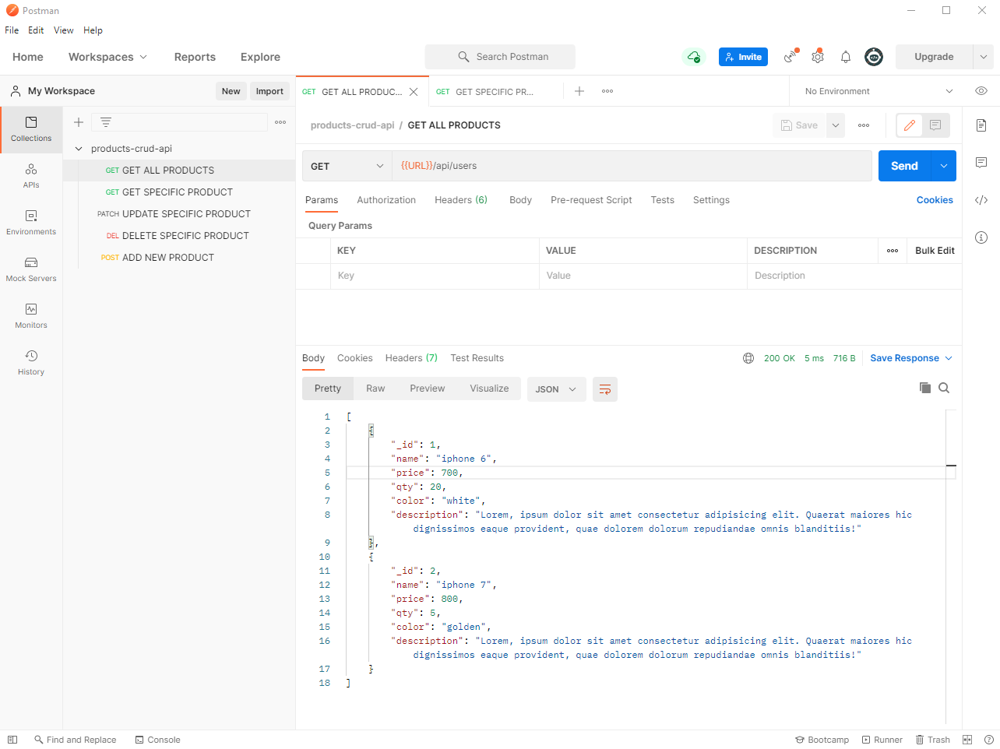

# Documentation




## Description

Creating a short CRUD API Applcation using Node.js, Express. The data was taken from a JS file, in this example I did not use a database, I wanted to keep the project to a standard level and learn more about what CRUD means.

## Usage

### Env Variables

Create .env file in then root and add the following

```
PORT = xxxx
```

### Install Dependencies

```
npm install
```

### Run The Application

```
npm start
```

## How to check results

- I recommand to use Postman to see the results, they have an application made to see the data in a better way than browser.

## License

The MIT License

Copyright (c) 2021 Dumitrache Florentin

Permission is hereby granted, free of charge, to any person obtaining a copy of this software and associated documentation files (the "Software"), to deal in the Software without restriction, including without limitation the rights to use, copy, modify, merge, publish, distribute, sublicense, and/or sell copies of the Software, and to permit persons to whom the Software is furnished to do so, subject to the following conditions:

THE SOFTWARE IS PROVIDED "AS IS", WITHOUT WARRANTY OF ANY KIND, EXPRESS OR IMPLIED, INCLUDING BUT NOT LIMITED TO THE WARRANTIES OF MERCHANTABILITY, FITNESS FOR A PARTICULAR PURPOSE AND NONINFRINGEMENT. IN NO EVENT SHALL THE AUTHORS OR COPYRIGHT HOLDERS BE LIABLE FOR ANY CLAIM, DAMAGES OR OTHER LIABILITY, WHETHER IN AN ACTION OF CONTRACT, TORT OR OTHERWISE, ARISING FROM, OUT OF OR IN CONNECTION WITH THE SOFTWARE OR THE USE OR OTHER DEALINGS IN THE SOFTWARE.